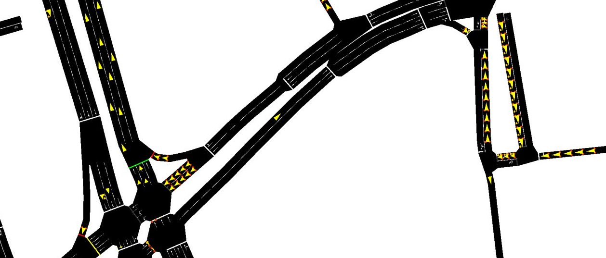
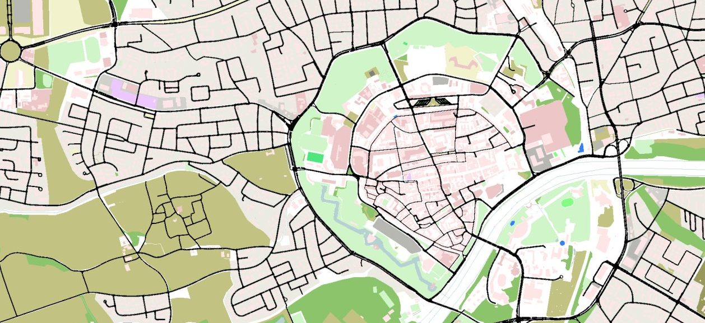
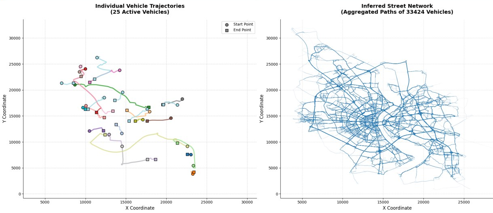
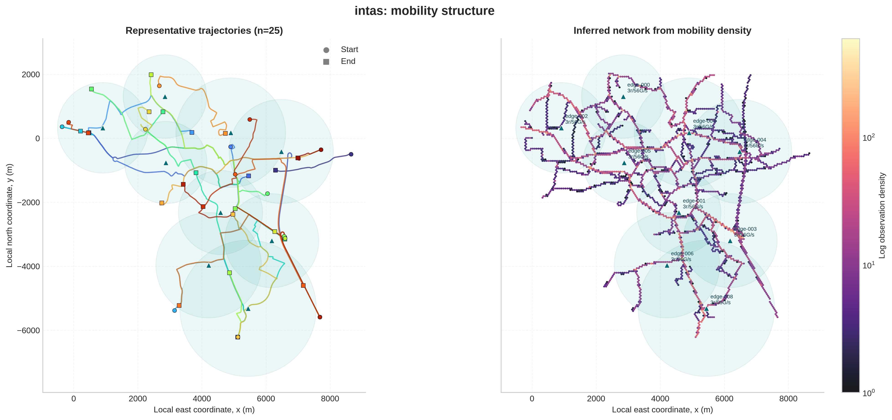
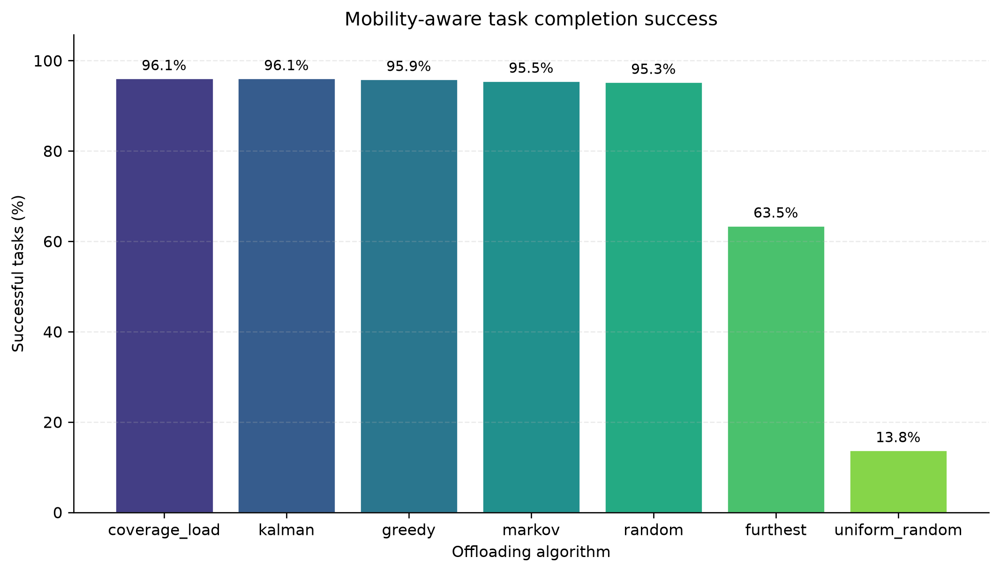
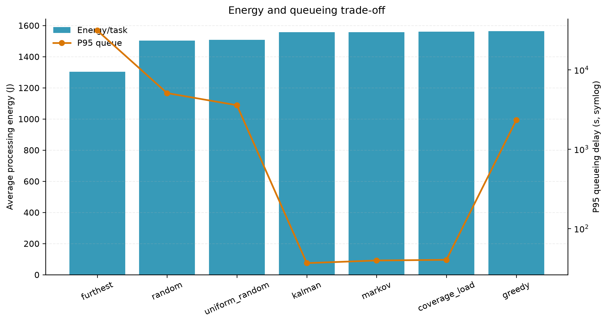
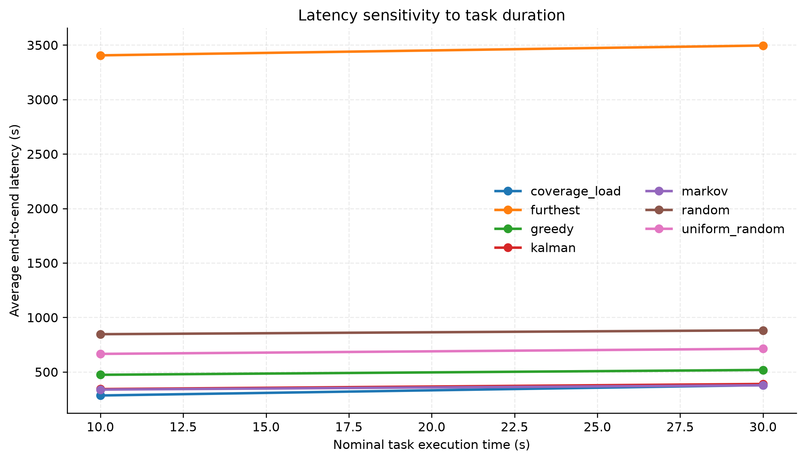

# Vehicular Edge Computing (VEC) Simulator

## Overview
This project provides a simulation environment for Vehicular Edge Computing (VEC). As vehicles move through an urban environment, they generate computational tasks with varying sizes and execution times. The in-vehicle embedded system must dynamically select the optimal edge server and compute resource pair. 

This decision is made by evaluating the vehicle's current state, task duration, server radio coverage, processing capacity, and resource queue lengths. The simulator ensures a strict separation between training, inference, and evaluation; the predictive models do not have access to future trajectories or raw data during the decision-making process.

## Key Features
*   **Multiple Compute Resources:** Simulates heterogeneous server environments including eco CPUs, balanced CPUs, and accelerated GPUs, each with independent queues, capacities, and energy consumption rates.
*   **Server Placement Strategies:** Supports map-wide server distribution using a data-driven Density clustering approach to place servers near high-traffic areas.
*   **Strict Evaluation:** Models are evaluated based on real-time inference without looking ahead at future GPS traces. Success requires the vehicle to be within the server's coverage radius at both the start and completion of the task.

## Datasets
The project utilizes four distinct mobility datasets to ensure the algorithms are tested against both synthetic and real-world traffic patterns:
*   **InTAS & TAPAS:** Simulated urban traffic scenarios generated via SUMO (Germany).
*   **Roma & T-Drive:** Real-world GPS taxi traces with variable sampling rates and long pauses (Italy and China).

## Algorithms
The simulator evaluates several baseline and advanced offloading strategies:
*   **Baselines:** Greedy, Random, Uniform Random.
*   **Predictive & Heuristic Methods:** Kalman Filter, Markov Chain, GRU (Gated Recurrent Unit) Network, and a custom Coverage Load strategy.

---

## Visualizations and Results

### Datasets and Mobility

*Vehicles and movement on the road network in the SUMO simulator.*


*City overview in the SUMO simulator.*


*Left: Active vehicle traces. Right: Inferred street network from aggregated traces.*

### Server Placement Strategies

*Server distribution using the Density (clustering) method.*

### Performance and Evaluation

*Algorithm success rates for the InTAS dataset under normal load conditions.*


*Comparison of energy consumption and queue times in the TAPAS dataset.*


*The impact of task duration on overall latency under heavy load conditions.*

---

## How to Run

## 1. Replace the data folder
Download the dataset archive from [here](https://drive.google.com/file/d/12ciReCp9kiluDCTWxQ63dIaKMRpfjhhb/view?usp=sharing)

Extract its contents into the project root, replacing the existing `data/` folder.  
The final structure should look like:
```
data/
  raw/
  processed/
```

## 2. Install
```bash
pip install -e .
# Optional: GRU support: pip install -e ".[deep-learning]"
```

## 3. Core commands

### Create edge-server placement
```bash
edge-project place-servers --dataset tapas --output env.json
```

### Plot mobility
```bash
edge-project plot --dataset tapas --environment-file env.json --output plot.png
```

### Train agents
```bash
edge-project train --dataset tapas --environment-file env.json --algorithm greedy kalman markov
```

### Evaluate trained agents
```bash
edge-project evaluate --dataset tapas --environment-file env.json --algorithm greedy kalman markov --output results/
```

### Single inference test
```bash
edge-project infer --dataset tapas --algorithm kalman --x 1000 --y 500 --speed 15 --angle 90 --duration 30
```

## 4. Run the full pipeline (all datasets)
```bash
./run_all.sh        # normal mode
./run_all.sh heavy  # high load mode
```
